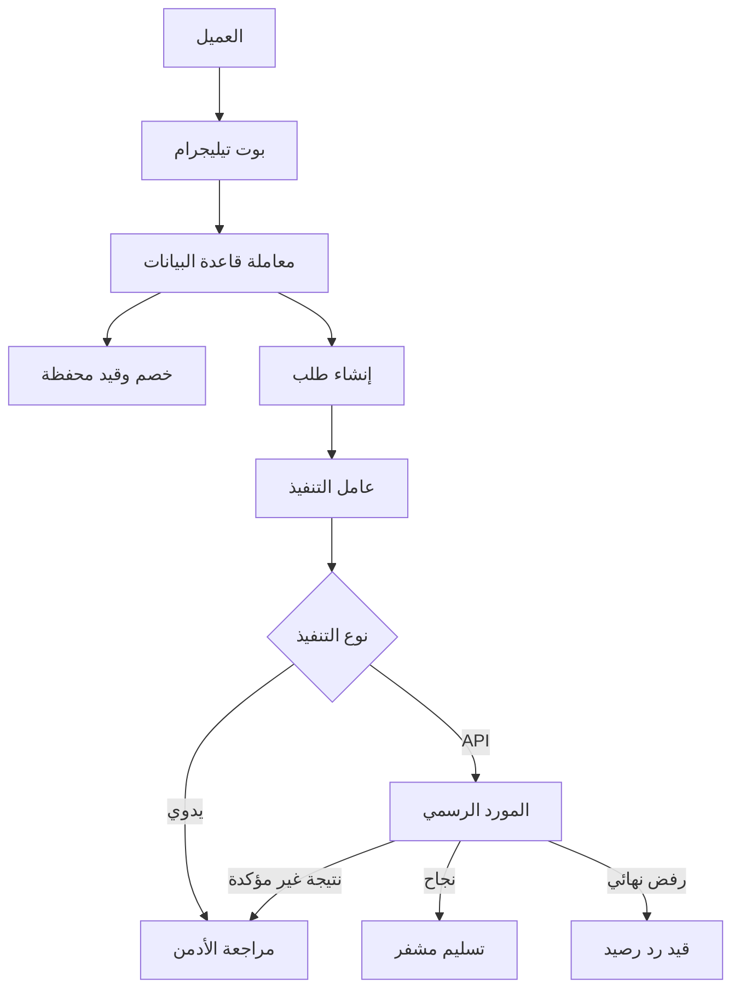

# التصميم

## دورة الشراء

لا يُستدعى المورد داخل معاملة الخصم. يُحفظ الطلب أولًا ثم يلتقطه العامل. هذا يمنع إبقاء قفل المحفظة أثناء انتظار الشبكة ويجعل التعافي ممكنًا.

## دورة الشحن

| الطريقة | التأكيد | إضافة الرصيد |
| --- | --- | --- |
| Binance Pay | webhook موقّع من Binance + مطابقة المبلغ والعملة | تلقائي وقابل لمنع التكرار |
| الكريمي API | موصل رسمي بعد عقد التاجر | تلقائي بعد توقيع/مرجع البنك |
| الكريمي اليدوي | رقم عملية + إثبات + مطابقة أدمن | عند الاعتماد فقط |
| جيب API | فقط إن قدم المزود وثائق تجارية | حسب العقد |
| جيب اليدوي | رقم عملية + إثبات + مطابقة أدمن | عند الاعتماد فقط |

## حالات تحتاج قرارًا بشريًا

- timeout بعد إرسال أمر شراء للمورد.
- استجابة مورد غير معروفة أو طلب بقي pending.
- اختلاف مبلغ أو عملة حدث دفع موثّق.
- إثبات تحويل يدوي.
- تسليم يدوي أو رد رصيد.

## حدود الثقة

- تيليجرام ينقل الرسائل ولا يُعتبر دفتر حسابات.
- PostgreSQL هو مصدر حقيقة الرصيد والطلبات.
- Redis يحفظ حالة المحادثة فقط ولا يحفظ الرصيد.
- أي نص من المستخدم أو المورد يُعامل كبيانات غير موثوقة ويُهرب قبل HTML.
- أسرار العميل والتسليم مشفرة، بينما كلمات المرور وOTP ممنوعة أصلًا.
